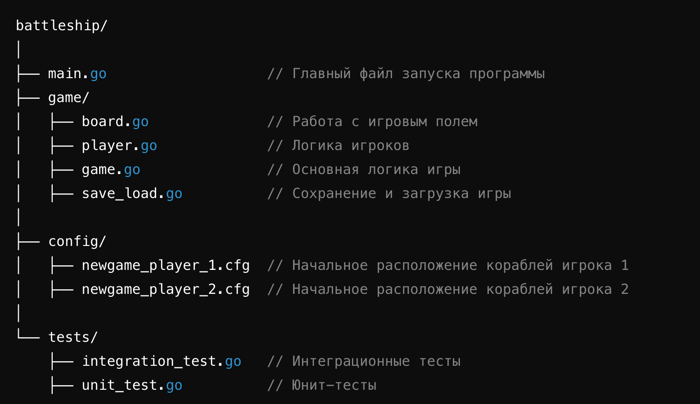

# Консольная игра "Морской бой"
## Требования к игре
### 1. Формат игры:

- Размер игрового поля: 10×10 клеток.
  - Корабли:
  - Один корабль размером 4×1 клетка.
  - Два корабля размером 3×2 клетки.
  - Три корабля размером 2×1 клетка.
  - Четыре корабля размером 1×1 клетка.
- Корабли не могут касаться друг друга.

### 2. Приложение:

- Консольная игра с двумя пунктами меню:
    - "Начать новую игру".
    - "Продолжить игру".
  
### 3. Начало новой игры:

- Загрузка двух файлов с начальными расположениями кораблей для обоих игроков (формат: 1 — клетка корабля, 0 — пустая клетка). Пример имен файлов:
    - newgame_player_1.cfg
    - newgame_player_2.cfg.
- Первый ход за player1.
- Игрок вводит команду exit или координаты выстрела (например, a1, j10).
- Правила:
  - Попадание: игрок стреляет снова.
  - Промах: ход переходит к другому игроку.
  - Повторный выстрел в ту же клетку или некорректный ввод требует повторного ввода.
  - Победа объявляется, если потоплены все корабли противника.

- Сохранение игры:
  - Файлы:
    - lastgame_player_1.cfg, lastgame_player_2.cfg: содержат текущий статус кораблей и выстрелов.
    - lastgame.cfg: номер хода и текущий игрок.
  
### 4. Продолжение игры:
- Загрузка файлов сохранения.
- Если загрузка успешна — продолжение игры.
- Если файлы отсутствуют или повреждены — возврат в главное меню.

# Требования к интеграционному тесту
### 1. Основной сценарий:
- Два тестовых игрока-бота.
- Если есть попадание в корабль, но он не потоплен, выстрел производится в соседние клетки.
- При промахе ход переходит другому игроку.

- Боты не допускают ошибок:
  - Не стреляют дважды в одну клетку.
  - Не стреляют в заведомо невозможные клетки.
- Если половина кораблей одного игрока уничтожена, игра сохраняется, завершается, а затем перезапускается с продолжения.

# Определение структуры проекта

## Интеграционный тест с ботами

#### 1. Два бота стреляют по полю противника:
- Рандомно выбирают точку, если нет поврежденных кораблей.
- Целенаправленно добивают корабли, если есть поврежденные.

#### 2. Передача хода:
- Если промах, ход передается другому игроку.

#### 3. Сохранение при потере половины кораблей:
- Если один из игроков теряет половину кораблей, игра сохраняется.

#### 4. Загрузка сохранения и продолжение:
- После сохранения игра загружается и продолжается с того же места.

#### 5. Завершение игры:
- Игра завершается, когда все корабли одного из игроков уничтожены.